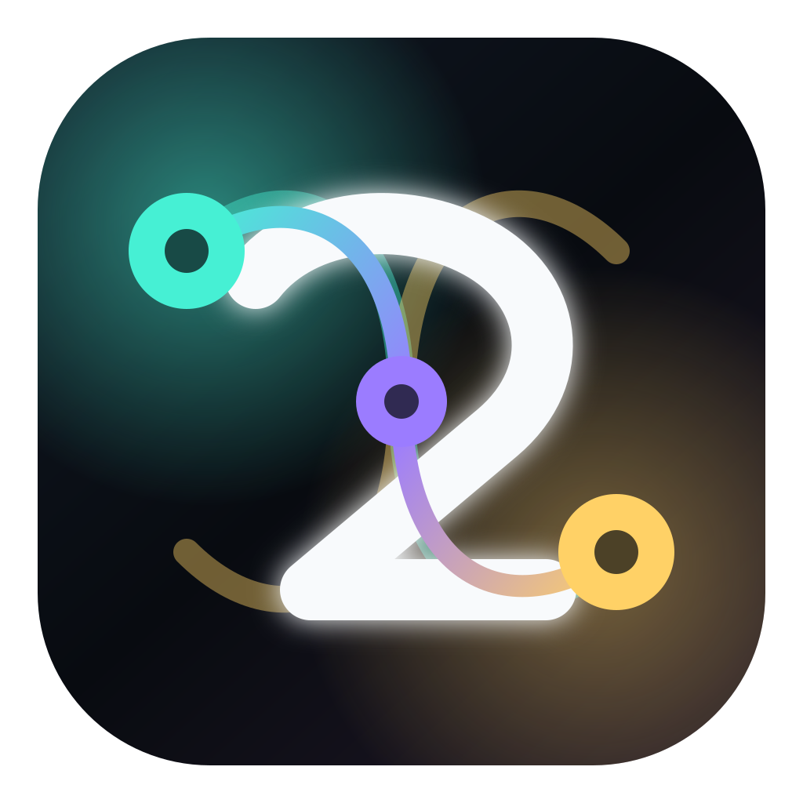
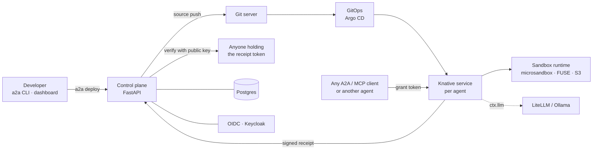

<p align="center">
  
</p>

<h1 align="center">A2A Cloud</h1>

<p align="center">
  <strong>Open-source platform for agents that talk to other agents.</strong><br>
  Write one class. Get a sandboxed, A2A + MCP compliant agent with a public URL,
  signed execution receipts, and scoped grants for calling other agents.
</p>

<p align="center">
  <a href="LICENSE"></a>
  <a href="https://pypi.org/project/a2a-pack/"></a>
  <a href="https://www.npmjs.com/package/a2a-pack-ts"></a>
  <a href="https://www.npmjs.com/package/a2amcp"></a>
  <a href="https://a2a-protocol.org"></a>
  <a href="https://modelcontextprotocol.io"></a>
  <a href="https://github.com/robGetsTheJobDone/a2a-cloud/actions/workflows/ci.yml"></a>
</p>

<p align="center">
  <a href="#quick-start">Quick start</a> ·
  <a href="#what-is-in-the-box">What's in the box</a> ·
  <a href="#how-it-works">How it works</a> ·
  <a href="SELF_HOSTING.md">Self-host</a> ·
  <a href="#repository-layout">Layout</a> ·
  <a href="CONTRIBUTING.md">Contributing</a>
</p>

---

## The problem

Google's [Agent2Agent protocol](https://a2a-protocol.org) (A2A) is how agents discover and call each other: Agent Cards,
tasks, messages, artifacts, streaming, auth. Implementing it by hand is tedious. Hosting an agent so that *other people's
agents* can call it safely, with real permissions, real sandboxes, and a record you can verify afterwards, is harder still.

A2A Cloud is the whole stack, MIT-licensed: SDK, control plane, dashboard, docs, and the meta-agents that build and
review other agents.

## Quick start

```bash
pip install a2a-pack
a2a init research-agent
cd research-agent
a2a dev --local          # http://127.0.0.1:8000  ·  console at /_dev
a2a test --invoke
```

That scaffold is a complete A2A + MCP agent. This is all the code it needs:

```python
from pydantic import BaseModel
import a2a_pack as a2a
from a2a_pack import A2AAgent, NoAuth, RunContext

class Config(BaseModel):
    suffix: str = "!"

class Greeter(A2AAgent[Config, NoAuth]):
    name = "greeter"
    description = "Say hi."
    version = "0.1.0"
    config_model = Config
    auth_model = NoAuth

    @a2a.tool(description="Greet someone.")
    async def greet(self, ctx: RunContext[NoAuth], who: str) -> str:
        await ctx.emit_progress(f"greeting {who}")
        return f"hello {who}{self.config.suffix}"
```

Every `@a2a.tool` is published in the Agent Card's `skills`, reachable over A2A JSON-RPC, REST, and MCP.
Log the CLI into a control plane and `a2a deploy` builds the image and hands back a URL:

```bash
a2a call research-agent greet who=world
# receipt  4b4d56883bb4d526  ->  a2a receipt verify 4b4d56883bb4d526
a2a receipt verify 4b4d56883bb4d526
# PASS  research-agent.greet · ok · 12ms · Ed25519 signature valid
```

Prefer TypeScript? `a2a init my-agent --language typescript`. Same card, same runtime contract, same deploy.
Go and Rust sidecars implement the demo contract.

## What is in the box

| | |
|---|---|
| **SDK + CLI** `sdk/a2a-pack` | Typed tools, packed React/static frontends, `a2a.yaml` DSL, hot-reload dev server with a local console, OpenAPI-to-agent import, MCP export, TypeScript sidecar (`a2a-pack-ts`) |
| **Agent-to-agent grants** | Every cross-agent call carries an Ed25519-signed grant naming caller, callee, bucket, read/write patterns, and expiry. No ambient authority |
| **Execution receipts** | Each run seals an Ed25519-signed receipt: who called what, under which grant, what it touched, what came out. Verify offline with the public key |
| **Control plane** `control-plane/` | FastAPI service: auth, registry, builds and deployments, orchestration runs, files, schedules, managed Postgres per agent, per-agent email inboxes, organizations, admin API |
| **Sandboxed runtime** `apps/sandbox-runtime` | Agents run in microsandbox-backed pods with FUSE workspaces on S3-compatible storage and egress policies |
| **Dashboard, docs, admin** `web/`, `apps/admin` | Operate the fleet: runs, logs, receipts, mailboxes, dev boxes, proofs |
| **Meta-agents** `apps/agent-*` | Agent Studio, Agent Builder, Agent Reviewer, and a code-editor agent that scaffold, sandbox-test, review, and edit other agents |
| **Local MCP gateway** `apps/a2a-mcp` | Expose any deployed agent to Claude Code, Cursor, or any MCP client from your editor |

Docs live in [`web/apps/docs/content`](web/apps/docs/content). The reference pages there are generated from the
SDK and control-plane source, and CI fails if they drift.

## How it works



**Grant** (what a callee sees on every request):

```json
{ "issuer": "main-agent:user-7", "audience": "graph-agent",
  "bucket": "user-7-files", "mode": "read_write_overlay",
  "allow_patterns": ["**"], "write_prefixes": ["outputs/"],
  "expires_at": 1717440000, "nonce": "e7f9…" }
```

**Receipt** (what a caller keeps after the run): a frozen record signed over its canonical payload. Fields, wire format,
and an honest list of what a receipt does *not* prove are in
[`web/apps/docs/content/concepts/receipts.md`](web/apps/docs/content/concepts/receipts.md).

## Run it

Each component is a normal project with its own Dockerfile and test suite:

```bash
cd sdk/a2a-pack   && uv sync --all-extras && uv run pytest -q     # SDK + CLI
cd control-plane  && uv sync --all-extras && uv run pytest -q     # control plane
cd web            && pnpm install && pnpm typecheck && pnpm test  # dashboard + docs
```

Running the full platform needs Postgres, an OIDC provider, a Git server, Kubernetes with Knative, and an
S3-compatible store. [SELF_HOSTING.md](SELF_HOSTING.md) lists every component, its image, and its environment
variables.

## Repository layout

| Path | What |
|---|---|
| `sdk/a2a-pack` | Python SDK + CLI, TypeScript sidecar, Go/Rust demo sidecars, examples |
| `control-plane/` | FastAPI control plane, its design docs, and the `main_agent` orchestrator |
| `web/apps/dashboard` | Vite + React operator dashboard |
| `web/apps/docs` | Next.js docs site with source-generated reference pages |
| `web/packages/design-system` | Shared UI components |
| `apps/admin` | Next.js admin console |
| `apps/a2a-mcp` | `a2amcp`: local stdio MCP gateway for editors |
| `apps/agent-studio` `agent-builder` `agent-reviewer` `code-editor-agent` | Meta-agents |
| `apps/graph-agent` `test-helper` | Example public agents |
| `apps/sandbox-runtime` | Host-side sandbox execution service |
| `apps/devbox` | Per-agent cloud dev box image |
| `apps/e2e` | Black-box API tests against a running platform |

Every directory carries an `agent.md`: contracts, commands, and conventions written for humans **and** coding
agents. Open the repo in Claude Code or Cursor and it already knows its way around.

## Status

The SDK and control plane run the hosted service at a2acloud.io. The meta-agents and the capability-graph work under
`control-plane/docs/design` are active research. Expect breaking changes on `main` until 1.0.

## Contributing

Issues and PRs are welcome. Start with [CONTRIBUTING.md](CONTRIBUTING.md). Security reports go through
[SECURITY.md](SECURITY.md). Be kind: [CODE_OF_CONDUCT.md](CODE_OF_CONDUCT.md).

If this saved you a week, a ⭐ helps other people find it.

## License

[MIT](LICENSE)
